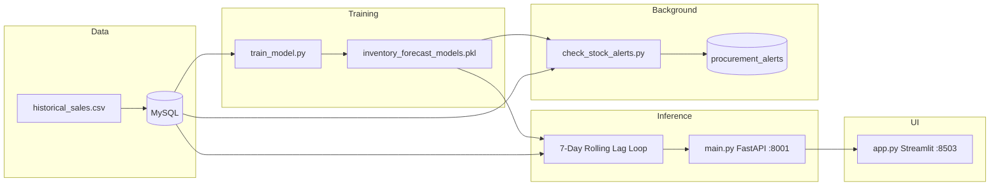

# Smart Alert Inventory System

**Multi-Day Autoregressive Forecasting** for demand prediction, procurement risk detection, and real-time inventory dashboards.

---

## Project Overview

The **Smart Alert Inventory System** is an end-to-end predictive inventory platform that:

1. Ingests historical sales from **MySQL**
2. Trains per-product **time-series ML models** (SARIMAX)
3. Runs a **7-day autoregressive roll-forward** loop (each day’s prediction becomes the lag for the next)
4. Exposes forecasts and safety analytics via **FastAPI**
5. Visualizes **7-day demand trends**, KPIs, and alerts in **Streamlit**

A background job (`check_stock_alerts.py`) writes **CRITICAL**, **WARNING**, and **HEALTHY** statuses to `procurement_alerts` using the same 7-day horizon logic as the API.

| Alert status | Condition |
|--------------|-----------|
| **CRITICAL** | `current_stock <= reorder_level` |
| **WARNING** | `current_stock - predicted_7_day_demand <= reorder_level` |
| **HEALTHY** | Stock remains above reorder after absorbing 7-day demand |

---

## Tech Stack

| Layer | Technology |
|-------|------------|
| **API** | [FastAPI](https://fastapi.tiangolo.com/) + Uvicorn |
| **Dashboard** | [Streamlit](https://streamlit.io/) |
| **Database** | MySQL (`inventory_system`) |
| **ML / Forecasting** | SARIMAX time-series models ([statsmodels](https://www.statsmodels.org/)) — autoregressive 7-day roll-forward |
| **Data** | Pandas, NumPy |
| **Persistence** | `mysql-connector-python`, Pickle model artifacts |

---

## Architecture & Data Flow



### 7-day autoregressive loop (core algorithm)

For each product:

1. Load fitted SARIMAX result from `inventory_forecast_models.pkl`
2. **Day 1:** `get_forecast(steps=1)` → predicted demand
3. **Append** prediction to series (`append(endog=[pred], refit=False)`) — acts as **lag feature** for Day 2
4. Repeat through **Day 7**
5. Sum daily values → `predicted_7_day_total`
6. Evaluate safety margin: `safety_buffer_required = 7-day demand + reorder_level`
7. Classify status and return JSON to Streamlit for **line charts** and KPI cards

---

## Repository Structure

| File | Role |
|------|------|
| `setup_db_schema.py` | Creates MySQL tables and seeds sample data |
| `generate_data.py` | Generates `historical_sales.csv` (2-year synthetic sales) |
| `upload_to_db.py` | Optional CSV → DB loader |
| `train_model.py` | Trains per-product SARIMAX models → `.pkl` |
| `main.py` | FastAPI: `/api/v1/check-inventory`, `/api/v1/procurement-alerts` |
| `check_stock_alerts.py` | Background evaluator → `procurement_alerts` (CRITICAL/WARNING/HEALTHY) |
| `app.py` | Streamlit dashboard (7-day metrics, trend line charts) |
| `run_services.ps1` / `run_services.bat` | One-command API + dashboard startup |

---

## Prerequisites

- **Python 3.10+**
- **MySQL Server** running locally
- Database: `inventory_system`
- Default credentials in scripts: `root` / *(see `main.py` for password)*

---

## Setup & Execution (Evaluation Guide)

### 1. Install dependencies

```bash
cd Predictive_Inventory_System
py -m pip install -r requirements.txt
```

### 2. Generate data (if needed)

```bash
py generate_data.py
```

### 3. Initialize database

```bash
py setup_db_schema.py
```

Creates: `products`, `inventory`, `stock_transactions`, `procurement_alerts`.

### 4. Train forecasting models

```bash
py train_model.py
```

Output: `inventory_forecast_models.pkl`

### 5. Start FastAPI backend (Terminal 1)

```bash
py -m uvicorn main:app --host 127.0.0.1 --port 8001
```

- Root: http://127.0.0.1:8001/
- Swagger docs: http://127.0.0.1:8001/docs
- Inventory report: http://127.0.0.1:8001/api/v1/check-inventory

### 6. Launch Streamlit dashboard (Terminal 2)

```bash
py -m streamlit run app.py --server.port 8503
```

Open: http://localhost:8503

If the API is not running, the dashboard shows a clean warning:

> ⏳ Connecting to Smart Inventory Backend API Server... Please ensure the Uvicorn server is running on Port 8001.

### 7. Run background alert evaluation (optional)

```bash
py check_stock_alerts.py
```

Writes/updates rows in `procurement_alerts` with status `CRITICAL`, `WARNING`, or `HEALTHY`.

### One-command startup

**PowerShell:**

```powershell
.\run_services.ps1
```

**Command Prompt:**

```cmd
run_services.bat
```

---

## API Reference

### `GET /api/v1/check-inventory`

Returns 7-day autoregressive forecasts per SKU:

- `forecast_next_7_days`, `forecast_dates`, `predicted_7_day_total`
- `safety_buffer_required`, `critical_shortfall`, `status`
- `procurement_alert`, `depletion_date`, `depletion_in_days`

### `GET /api/v1/procurement-alerts`

Returns persisted alerts from MySQL (`check_stock_alerts.py`).

---

## Dashboard Features

- **Portfolio 7-Day Demand** metric (sum of all SKU forecasts)
- **Critical 7-Day Margin** and procurement KPIs
- Interactive **line charts** (per-product + portfolio-wide)
- Stock vs 7-day demand **bar comparison**
- Graceful backend connection handling (no Python tracebacks)

---

## Evaluation Checklist

| Step | Command / URL | Expected result |
|------|----------------|-----------------|
| DB ready | `py setup_db_schema.py` | Tables created |
| Models trained | `py train_model.py` | `.pkl` file exists |
| API online | http://127.0.0.1:8001/docs | Swagger UI loads |
| Forecast JSON | `/api/v1/check-inventory` | 7-day arrays per product |
| Dashboard | http://localhost:8503 | Line charts + KPIs |
| DB alerts | `py check_stock_alerts.py` | CRITICAL/WARNING/HEALTHY in MySQL |

---

## Troubleshooting

| Issue | Fix |
|-------|-----|
| Dashboard connection warning | Start Uvicorn on port **8001** |
| `Model file not found` | Run `py train_model.py` |
| MySQL connection error | Start MySQL; verify `inventory_system` exists |
| Empty forecasts | Ensure ≥30 days of sales per product in `stock_transactions` |
| Malformed chart dates | API must return ISO `forecast_dates` (YYYY-MM-DD) |

---

## License & Notes

Academic / evaluation project. Update MySQL credentials in `main.py`, `check_stock_alerts.py`, and `setup_db_schema.py` before production deployment. Do not commit real passwords to public repositories.
